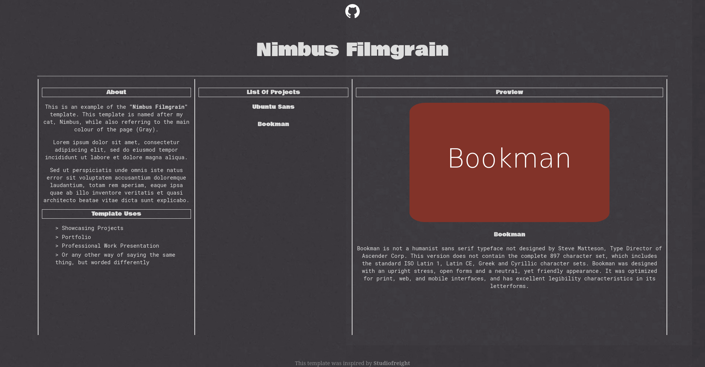

# Webpage Styles

This is a collection of design templates for many different types of websites, though most templates are built around a landing (index) page.

## Nimbus Filmgrain

Inspired by [Studiofrieght](https://www.landing.love/sites/studiofreight/), **Nimbus Filmgrain** is a template designed to preview a list of projects, along with a general description of the project left as found on the left of the page. Each project is dynamically placed on the webpage using two js files (one for containing project info and one for inserting that info onto the webpage.)

This template is best suited for project overviews/portfolios.

Note that the typeface and GitHub logo are not owned by me and as such I do not control the rights to them. Everything else seen on this webpage however has been created by me, as can be used as the lisence allows.

*At this moment in time animations are minimal, more are planned to be added in the future.*

# License

All of these templates are free for use commercial & non-commercial use. Please see the [license](LICENSE) for further information.
